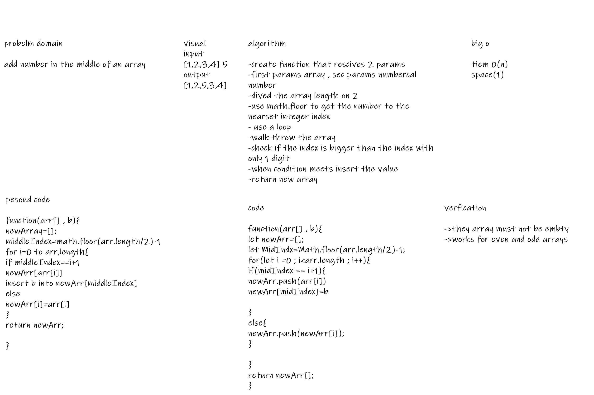

# Insert to Middle of an Array
**function that do to insert a number middle of array and return it into a new array**

## Whiteboard Process
<!-- Embedded whiteboard image -->

## Approach & Efficiency
<!-- What approach did you take? Discuss Why. What is the Big O space/time for this approach? -->
**function to reseve two parameter , first one has array of number , second one has a value that need to insert it middle of array , then i dived the array length on 2 , and then i fill a new array with reccived arrays values as will as insert the value in the middle when the index reach it.**

