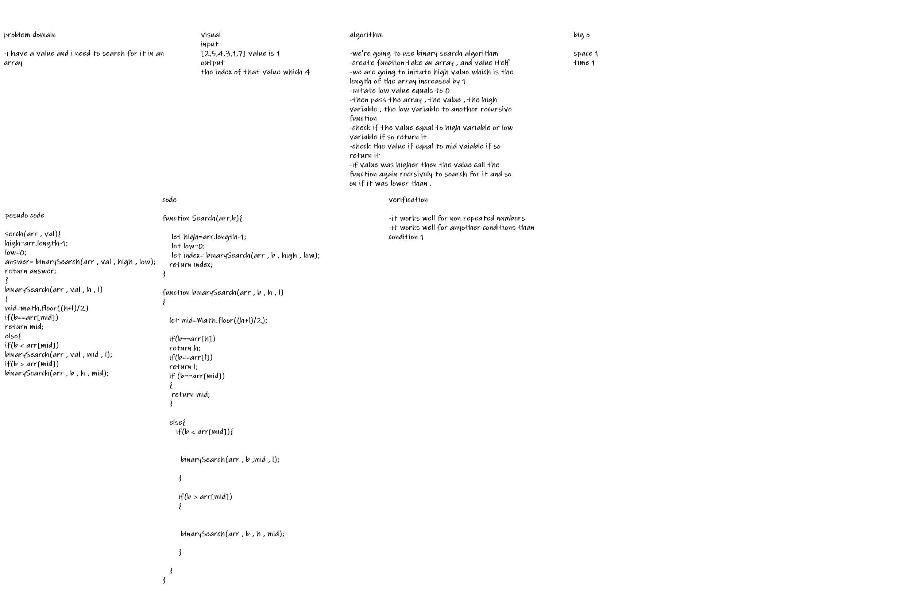

# binary Search of an Array
**function that do binary search for the array**

## Whiteboard Process
<!-- Embedded whiteboard image -->

## Approach & Efficiency
<!-- What approach did you take? Discuss Why. What is the Big O space/time for this approach? -->
**i have coded a function to binary search in recursive way which is faster than the ordinary loop**