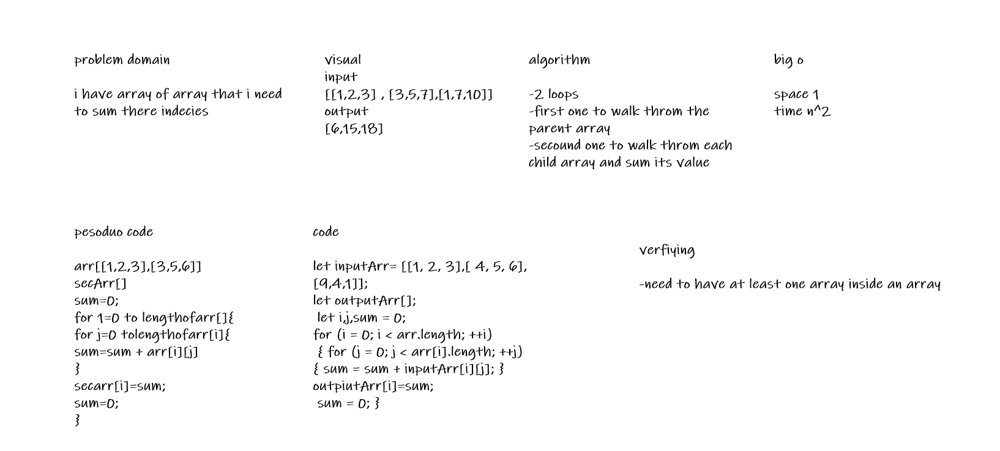

# baired code codechallenge >> sum array of array
**function that take one array of array**

## Whiteboard Process
<!-- Embedded whiteboard image -->

## Approach & Efficiency
<!-- What approach did you take? Discuss Why. What is the Big O space/time for this approach? -->
**we have used 2 loops to walk throw the arrays**