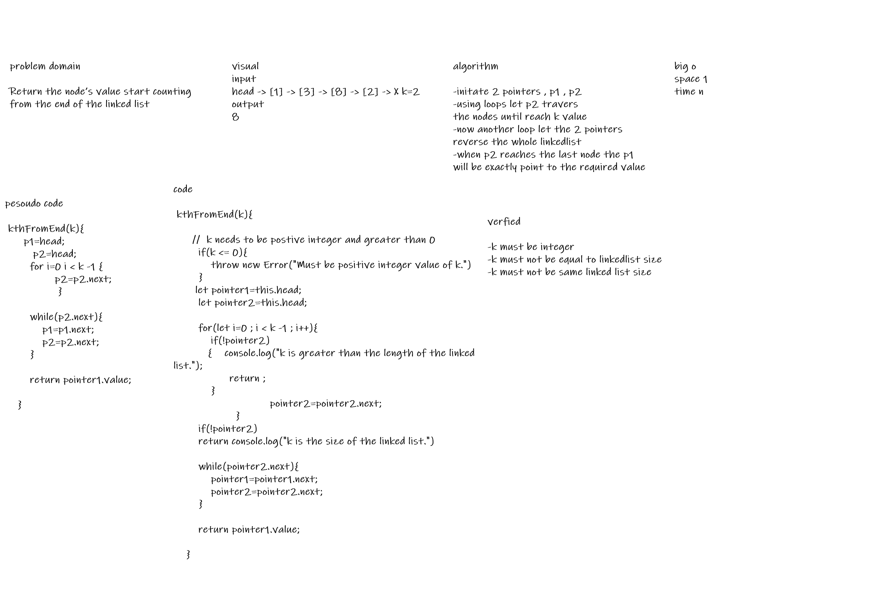

# Singly Linked List
<!-- Short summary or background information -->
**the problem is that we need to returns nodes value and look for it using 'K' argument as input of the index**
<!-- Description of the challenge -->
**method that takes k as argument and return the the value of the index statrs from the end**

## Approach & Efficiency
<!-- What approach did you take? Why? What is the Big O space/time for this approach? -->

## API
<!-- Description of each method publicly available to your Linked List -->
-  k is greater than the length of the linked list
- k and the length of the list are the same
-  k is not a positive integer
- the linked list is of a size 1
- “Happy Path” where k is not at the end, but somewhere in the middle of the linked list