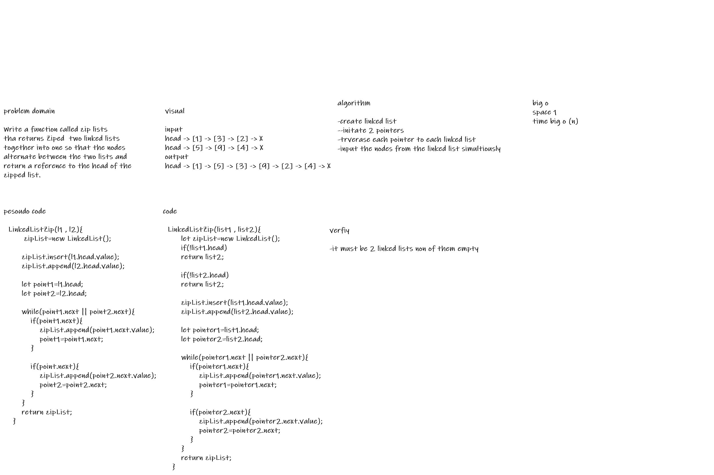
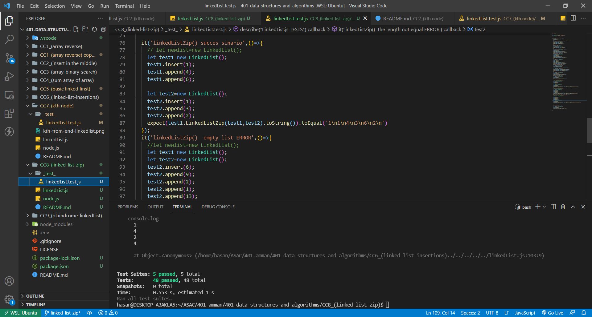

# Singly Linked List
<!-- Short summary or background information -->
**Write a function called zip lists
tha returns Ziped  two linked lists together into one so that the nodes alternate between the two lists and return a reference to the head of the zipped list**
<!-- Description of the challenge -->

## Approach & Efficiency
<!-- What approach did you take? Why? What is the Big O space/time for this approach? -->

## test

<!-- Description of each method publicly available to your Linked List -->
- linkedListZip() succes sinario
- linkedListZip()  empty list 
- linkedListZip()  the length not equal 
