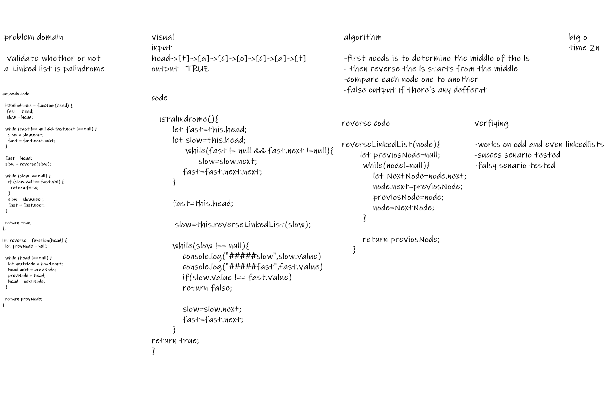
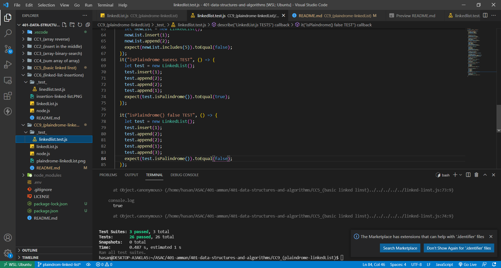

# Singly Linked List
<!-- Short summary or background information -->
**A palindrome is a word, phrase, number, or sequence of nodes which reads the same backward as forward.**
## Challenge
<!-- Description of the challenge -->
**a function to validate whether or not a Linked list is palindrome**

## Approach & Efficiency
<!-- What approach did you take? Why? What is the Big O space/time for this approach? -->

## TEST

## API
<!-- Description of each method publicly available to your Linked List -->
-all includes in the white board